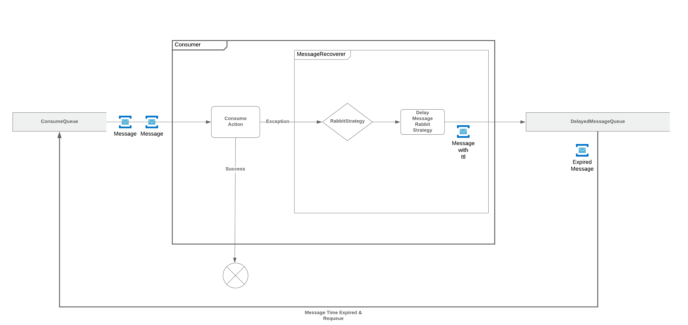

# Sample Consumer [](https://travis-ci.com/Merthaskan/sample-consumer)
Bu proje delayed message yöntemini göstermek için yapılmıştır. Projenin çalışma yapısı aşağıdaki şekildedir.\


Diğer diller için: [English](./README.en.md)

# Başlangıç
Aşağıda projenin paket yapısı, ön koşullar ve kurulum anlatılmaktadır.

## Ön Koşullar
* [Java 11 SDK](https://openjdk.java.net/projects/jdk/11/)
* [Jetbrains IntelliJ](https://www.jetbrains.com/idea/)
* [RabbitMQ](https://www.rabbitmq.com/download.html)

## Projenin Paket Yapısı
* Properties
* Configuration
* Consumer
* Service
* Recover

### Properties
Application.yaml da tanımlanan modellerin sınıflarını içermektedir.

### Configuration
**Spring Configuration** sınıflarını içermektedir.

### Consumer
**RabbitMQ Listener** sınıflarını içermektedir.

### Service
Projenin iş mantığının(business logic) kodlandığı pakettir.

### Recover
**Message Recoverer** sınıflarını içermektedir.

## Kullanılan Kütüphaneler
* Spring Boot
* Spring AMQP
* Lombok

## Kurulum
1. Projeyi klonlayınız.
2. RabbitMQ'yu başlatınız.
3. IntelliJ ile klonladığınız projeyi açınız.
4. ```mvn install``` komudunu çalıştırınız.
5. IntelliJ ile projeyi çalıştırınız.